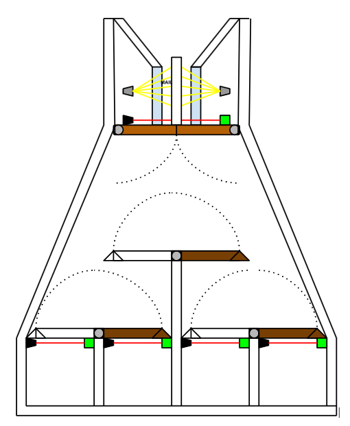
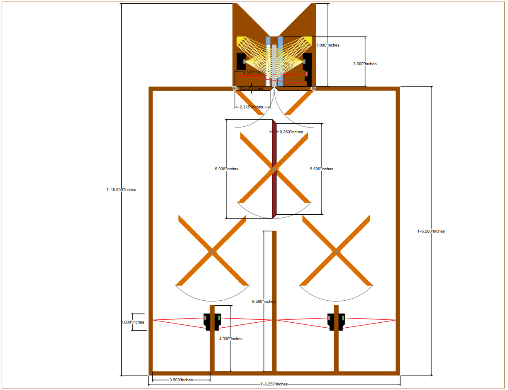
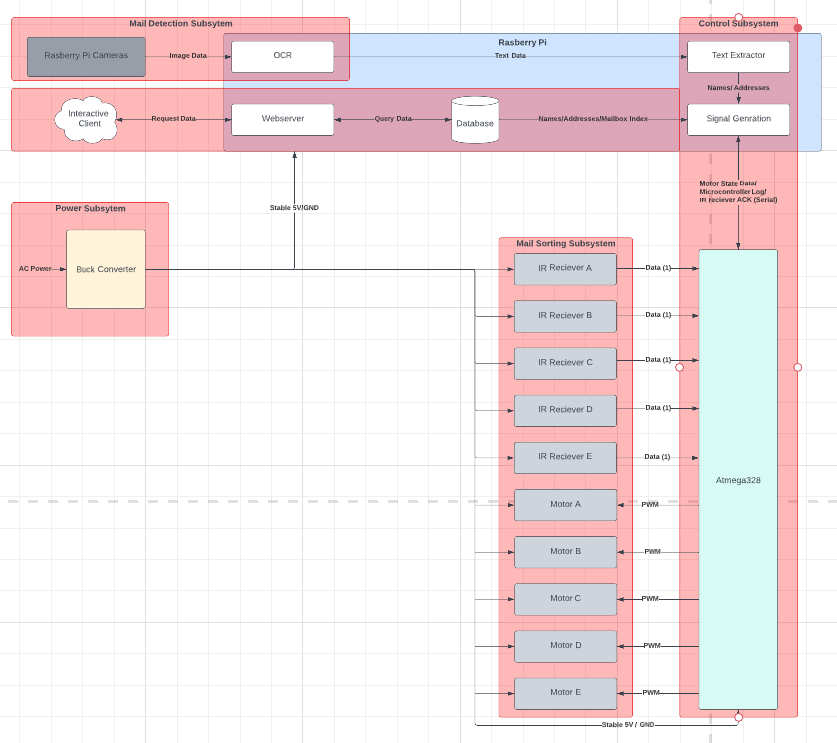
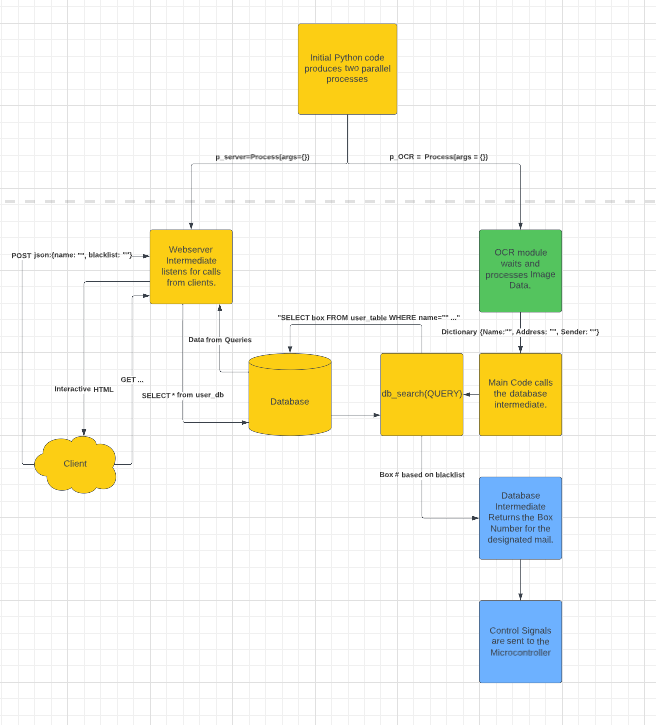

###Week 1 (01/23/2023):

####Rough notes on ideas from my phone:

#####Project General Ideas:
    Audio
        Speech
        Sample
        Music
        Spatial sound recognition module
    Bluetooth Something
    Smart mirror
    Video

###Week 2 (01/30/2023):

####Rough notes on ideas from my phone:
Ideas
3d scanner using cameras and image processing algorithms.
####Creation of the following google document: 
https://docs.google.com/document/d/1smCmXfJ1Qmnph_uVqpIzglHZJDQTCBmRfOryvHxqazc/edit

###Week 3 (02/06/2023):
####Created this sketch image of the mail sorter design through google docs:

###Week 4 (02/13/2023):
####Created the detailed mail sorter design through AutoCad2023:

###Week 5 (02/20/2023):

###Week 6 (02/27/2023):

####Notes from phone:
#####Design Review Notes:
- Add precision to final design document.
- Modify the block diagram to include signals.

###Week 7 (03/06/2023):
####Created the latest block diagram through lucidchart:

- https://lucid.app/lucidchart/a511f2d9-8f74-499c-aa87-c0099e6e537f/edit?page=0_0&invitationId=inv_d18fd97f-6218-4dc4-afc7-b95135b04948#

###Week 8 (03/13/2023):
SPRING BREAK

###Week 9 (03/20/2023):
####Created the following google sheets for responsibilities:
- https://docs.google.com/spreadsheets/d/1cQ2f-qEPJ1gdgIN_stmu1_RXbaX6aX75WbtmcZPWAKo/edit?usp=sharing

###Week 10 (03/27/2023):
####Created the control flow diagram through lucidchart for the progress report:

- https://lucid.app/lucidchart/d592b711-b974-4ff1-8c5a-040fdf2df1a1/edit?invitationId=inv_1680db4e-4e03-4881-908e-7fee324f8770&page=0_0#

###Week 11 (04/03/2023):
Imported notes taken from various sources.
####TODO:
    - Add the OCR as a subroutine in the project
    - Add the Webserver as a subroutine in the project
    - Create the main runner.
#### Hostnames for raspberry pi's
ssh angelos4@192.168.0.241
ssh angelos4@fe80::aa32:3120:7f5a:35c4%9
ssh smunamala@raspberrypi.local
#### Google document for parts and power requirements:
- https://docs.google.com/spreadsheets/d/1hoyRh6D9tdSWBaHMoY2PIpxR3ODnGfDbjW63Q1PvRAs/edit#gid=0
