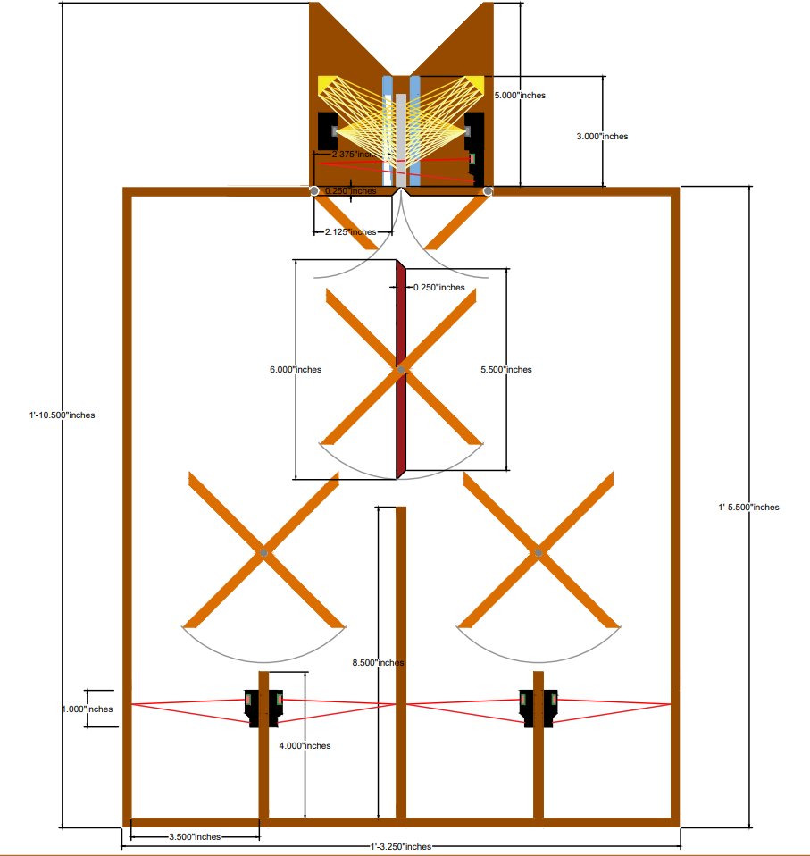
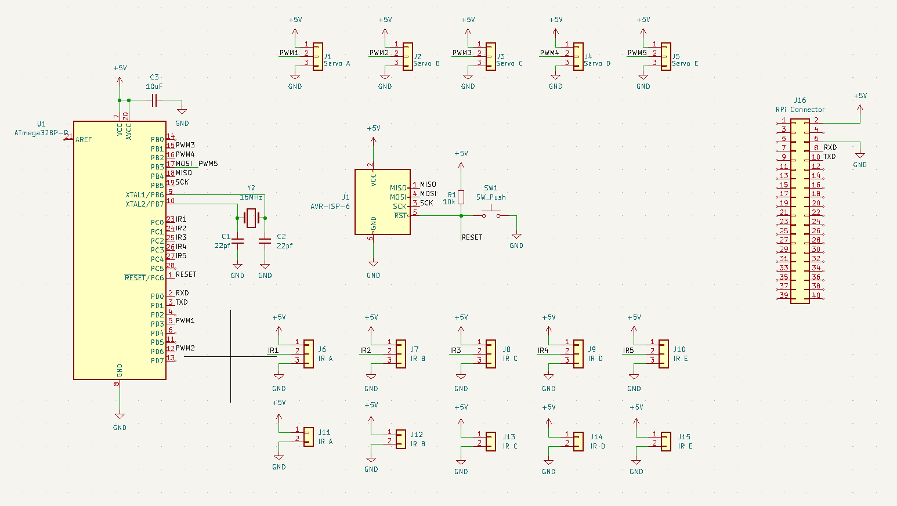
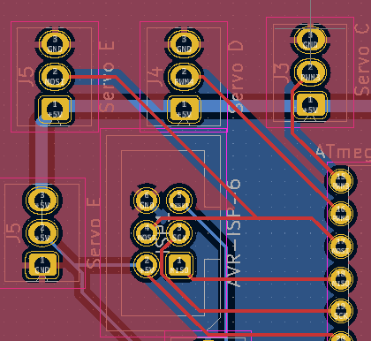
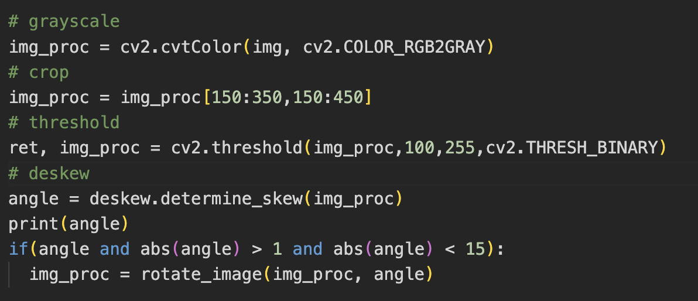
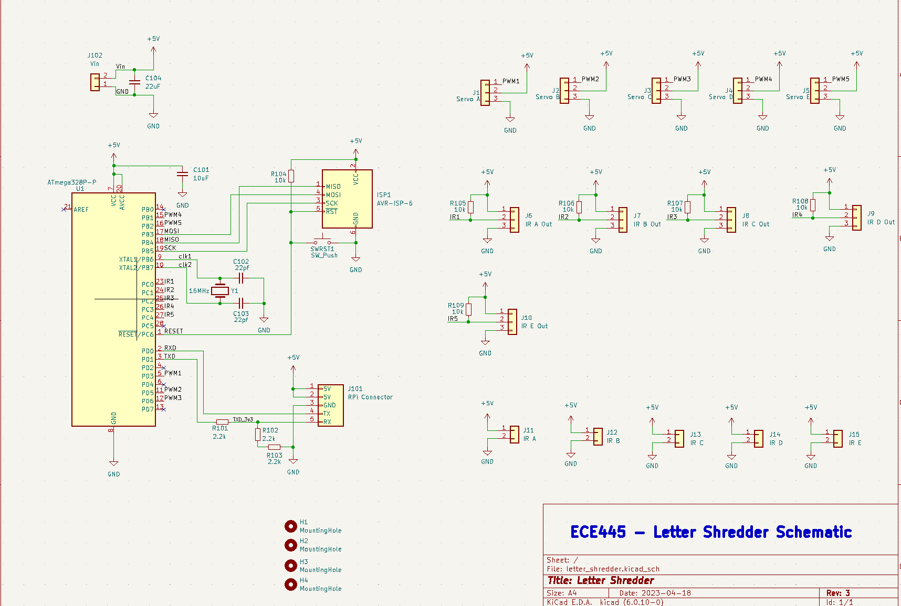
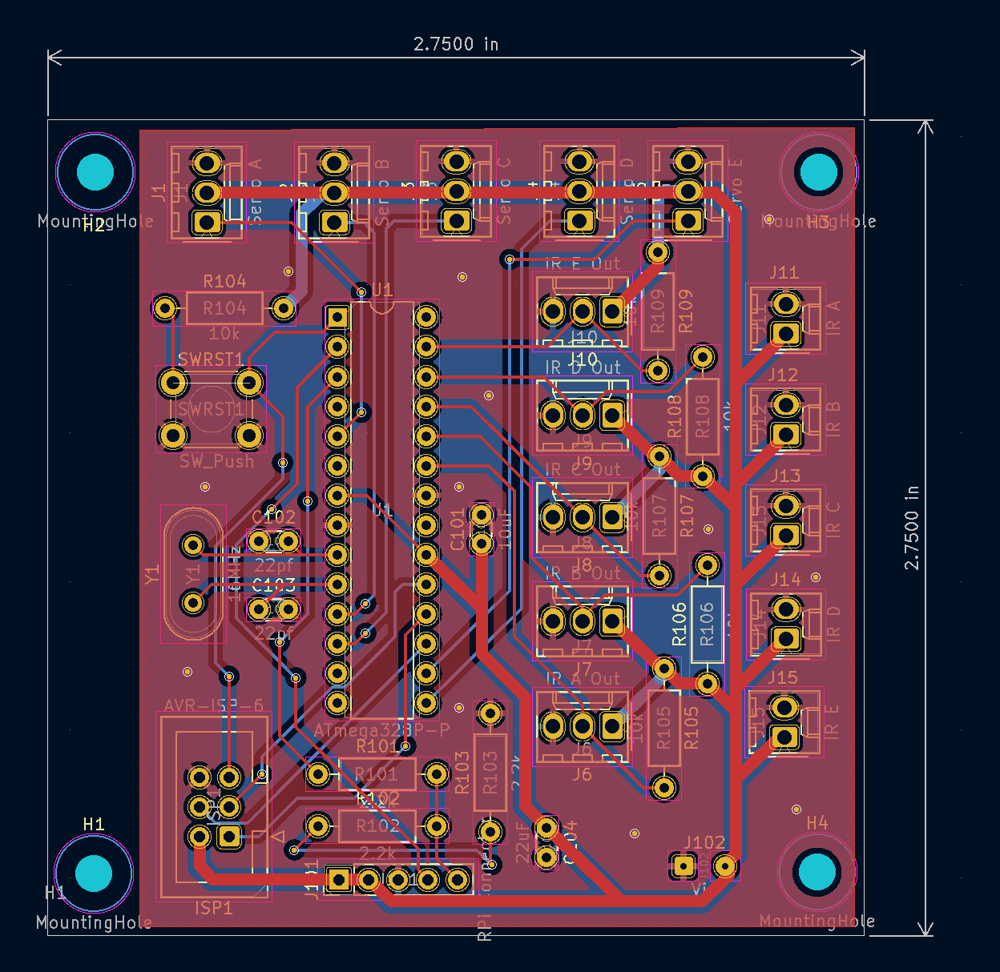

## 2/13 - Week 1

After submitting the proposal, this week was mainly used to gather information about parts we can use and start writing the design document. We have decided to make a mail sorter that can sort mail based on images it takes, then guide the mail to the correct box using gravity. Here is our example design

Me and Angelo spent the weekend developing this dimensioned drawing so we can hand it over to the machine shop for fabrication. The mail will be held up by two acrylic pieces, then dropped through a gate into the system. The paddles will flip in the direction necessary to guide the mail to the slot. At the end, a laser break system is used to determine if the mail has crossed the threshold, and the system is ready to take in the next piece of mail.

## 2/20 - Week 2

This week was spent mainly sourcing parts for our design. We are heavily relying on amazon to ship us items in two days or less for the more common parts. We are currently looking at Mouser and Digikey for smaller, more obscure parts, but we are trying to limit that as much as possible. Also, we are still writing out our design document. There are lots of small sections that require figures we don’t have. 

## 2/27 - Week 3

We had our design review this week. We brought our design and images to the table, and were largely okay’d. We had to make some changes to the document, such as adding a requirements and verification section for each of the subsystems. Other than that, work was ready to start for the project. The first step was the PCB design. Using KiCad and Google, I mocked up an example schematic that would work for our design. Here is the schematic:

The PCB has not been routed yet, but the design is there. We have not been able to test the schematic on the breadboard as we do not have a lot of the necessary components to build the circuit.

## 3/6 - Week 4

This week there was a lot of back and forth on the design with the machine shop. As the deadline for revisions to the work was Friday and right before break, we were scrambling to make sure the machine shop has everything they needed from us. We supplied the dimensioned drawing, with some small changes, and brought them some example parts so they could start development over the weekend. Also, this week, our first PCB was ordered (pictured). We still have not had a chance to test the circuit on a breadboard so this is just a shot in the dark.

## 3/20 - Week 5

Over break, no progress was made on the side of our team. We checked in with the machine shop, and progress has started on the design, but it is far from done. This week, we still haven’t received the PCB so progress was made on other subsystems. Work for the OCR subsystem has begun. I created a jupyter notebook and python environment with all the necessary libraries. I am able to take pictures with a USB webcam, and process them before sending to pytesseract OCR. This is the temporary code for the image processing pipeline.

First the image is converted to grayscale to reduce the amount of data by a factor of 3. Then, the image is cut to size based on where we expect the text to be. Next, A threshold is applied to convert the grayscale images to completely white or black pixels. Finally, a deskew is applied to make sure the lines are properly horizontal for the OCR to recognize. I played around with a few more filters, such as dilate and erode, but the improvement was small. Rather than leave it in with little idea of what it is doing, I decided to remove dilate/erode from the pipeline. I was following instructions from this link: Optical Character Recognition | OCR Text Recognition (analyticsvidhya.com)

## 3/27 - Week 6

This week, we received our PCB from China! After soldering the basic components, we found a few issues with the design. First of all, the programmer was wired incorrectly. MISO and MOSI were crossed, meaning we could not burn a bootloader to the ATMega chip without attaching to pins directly. This was a big mistake. As a result, we ditched the design of our first PCB and are building the circuit on a breadboard

The circuit is quite simple. There are three sections. First is the programmer to the left. This is where the 6 pin AVRISP programmer can be connected so that the microcontroller can be programmed. The second section is the ATMega and supporting circuitry. This includes the crystal oscillator which is necessary for the ATMega to program. Lastly, the servo motors are connected on the last section. We added capacitors to smooth the voltage line as servos draw power quickly. Occasionally, when too many servos moved at once, the power spike is so large that it causes the ATMega to shut off. This needs to be mitigated in the design.

We are currently looking into powering everything using a single 5V 8A power supply. This would supply ample current to all the components on the board running at once, and therefore be able to supply the motors with the instantaneous current they need.

Design work on the next PCB has started. We have incorporated the circuit on the breadboard into the new circuit design. PCB routing is yet to be done, as the deadline for ordering is next week Wednesday. Here is the new redesigned circuit.

## 4/3 - Week 7

This week, we ordered the new PCB. PCB routing is as shown below.

This week, I spent making the OCR system more robust. Using the same image processing pipeline as before, I made the python program that actually runs on the raspberry pi. This includes safely handling cameras and using multiprocessing to process one image, while the program is waiting for the camera lock for the second camera to release. 

Here is the test I designed so I can ensure that letter accuracy is over 80%. I would feed 10 pieces of mail through the slot, taking 2 pictures of each mail. Then, each image is processed and flipped to determine the text orientation. After removing all the images without any text inside, I counted the number of wrong characters in the inference, and kept a count. Out of 313 letters visible in the tests, only 14 were wrong, leading to a character accuracy of about 95.5%.

## 4/10 - Week 8

It turns out the email that went to the TA with the gerber files never reached its destination. As a result, we have decided to order the PCB ourselves, which should be coming the day of the demo. We are still using the breadboard to test all our embedded code, and the system is too big to mount on the back of the sorter. To make sure all the connections can be made, we are crimping our own set of extension wires. They are not measured, and as a result are too long to wire neatly. It is simply a stopgap before the new PCB comes, and we can get rid of all the extraneous wires.

As progress on the OCR pipeline is blocked without a working database and database connection, no work was done to further OCR this week. 

This week, we also received the design from the machine shop, finally. We are able to crimp wires to sensors, and get them connected to our breadboard. Making sure we can physically make all the connections to every component was the focus of this week. Outside of crimping wires, and soldering, I did not make significant progress on a subsystem this week. 

## 4/17 - Week 9

This week was the week of the final demo. Our PCB arrived Monday, and we soldered the components on immediately. Luckily, the programmer worked and everything else was correct on this PCB. 

This week was all about integrating the subsystems. Before the weekend, we made sure that every subsystem was working individually, but we have not had a chance to test everything together.

After the PCB was soldered though, I realized I connected the wrong pins to VCC for the servos, and we would still need the extension wires. As a result, the rats' nest did not leave. 

In the end, we got all the systems working together for the demo, and the OCR was working like a charm. Later in the week, when we were recording our video for extra credit, we noticed the OCR was having a tough time. After examining the images taken by the cameras, it was determined that they were knocked out of skew from the demo, and the cropping region was a little small. Ideally, the cropping would be determined by a convolutional neural network we trained ourselves, but we did not prepare training data and instead resorted to hardcoding the region of interest.

If I were to do this project again, I would focus on the hardware much earlier, as hardware iteration cycles are much longer than software. We were eventually successful in ordering a PCB and using it in our design, but we could have made it much smaller with SMD parts if we had more time.

Another improvement I would make to this project is improving the OCR system. The camera and camera lighting system is inconsistent and as a result, so is the OCR system. Any misalignment of the camera with respect to the light source can drown out the image, and the system detects nothing.

